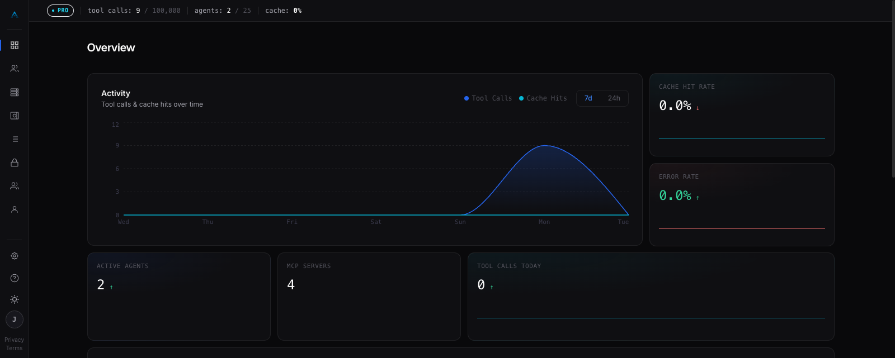

<div align="center">


# Arbiter

**The MCP security gateway for AI agents.**


[**arbiterai.dev →**](https://arbiterai.dev) · [**API Docs →**](https://arbiterai.dev/docs) · [**support@arbiterai.dev**](mailto:support@arbiterai.dev)

</div>

---

## The problem

Most teams give every AI agent the same credentials and let it call any tool it wants. Secrets are copy-pasted into `.env` files or hardcoded in prompts. There's no audit trail and no access control.

When something goes wrong — a runaway agent, a leaked key, a compliance audit — you have nothing.

## What Arbiter does

Arbiter is an MCP gateway that sits between your AI agents and your MCP servers. Every tool call flows through it:

- **Agent identity** — each agent gets a cryptographic API key (`nxai_...`). No shared credentials.
- **Tool-level RBAC** — grant only the tools each agent needs. `read_file` ≠ `delete_file`.
- **Encrypted vault** — secrets stored with AES-256-GCM, injected at proxy time. Agents never see raw keys.
- **Semantic cache** — similar tool calls return cached responses via pgvector ANN search. Cuts latency and cost.
- **Full audit log** — every request and response captured with duration, cache status, and agent identity.
- **Rate limiting** — per-agent, per-tool limits enforced at the gateway.



---

## Get started

### Hosted (free tier, no credit card)

1. Sign up at [arbiterai.dev](https://arbiterai.dev).
2. Register an agent → get your `nxai_...` key.
3. Point your MCP client at the gateway — done:

```json
{
  "mcpServers": {
    "arbiter": {
      "type": "http",
      "url": "https://api.arbiterai.dev/mcp",
      "headers": { "Authorization": "Bearer nxai_..." }
    }
  }
}
```

Works with Claude Code, Claude Desktop, Cursor, VS Code — anything that speaks MCP. All your registered MCP servers appear as one connection, tools namespaced as `server__tool`, RBAC-filtered per agent. See [docs/mcp-endpoint.md](./docs/mcp-endpoint.md).

### Self-hosted

```bash
git clone https://github.com/JaidenSy/Arbiter.git && cd Arbiter
cp .env.example .env   # set JWT_SECRET_KEY and VAULT_ENCRYPTION_KEY at minimum
docker compose up -d
# API on :8000  ·  frontend on :5173
```

Generate a vault key: `python -c "from cryptography.fernet import Fernet; print(Fernet.generate_key().decode())"`

Full env var reference in `.env.example`.

---

## How it works

### 1 — Register an agent

```bash
curl -X POST https://api.arbiterai.dev/api/v1/agents \
  -H "Authorization: Bearer <your-jwt>" \
  -d '{"name": "my-claude-agent"}'

# → { "api_key": "nxai_abc123..." }   ← shown once, store it
```

### 2 — Grant tool permissions

```bash
curl -X POST https://api.arbiterai.dev/api/v1/agents/<agent-id>/permissions \
  -H "Authorization: Bearer <your-jwt>" \
  -d '{"mcp_server_id": "<server-id>", "tool_name": "read_file"}'
```

### 3 — Proxy a tool call

Through any MCP client (see config above), or directly via the REST API:

```bash
curl -X POST https://api.arbiterai.dev/api/v1/proxy/tool-call \
  -H "Authorization: Bearer nxai_abc123..." \
  -d '{
    "server_name": "filesystem",
    "tool_name": "read_file",
    "params": { "path": "/app/config.json" }
  }'

# → { "result": {...}, "cached": false, "agent_id": "agt_xyz789" }
```

If the agent calls a tool it wasn't granted, it gets a `403`. Not a silent pass-through.

### 4 — Store secrets in the vault

Store once, reference everywhere — secrets are injected at proxy time, never written to plaintext config.

Dashboard → Vault → Add Secret:
```
Name: github_pat   Value: ghp_xxxx...
```

Reference in your MCP server's auth headers:
```
Authorization: {{vault:github_pat}}
```

Arbiter resolves `{{vault:github_pat}}` at call time. The raw token never touches the database.

---

## Architecture

```
Your AI Agent
      │  Bearer nxai_...
      ▼
┌─────────────────────────────────────┐
│           Arbiter Gateway           │
│                                     │
│  ┌─────────┐  ┌───────┐  ┌───────┐ │
│  │  RBAC   │  │ Vault │  │ Cache │ │
│  └────┬────┘  └───┬───┘  └───┬───┘ │
│       └───────────┴───────────┘     │
│                   │                 │
│              ┌────▼────┐            │
│              │  Proxy  │            │
│              └────┬────┘            │
└───────────────────┼─────────────────┘
                    │
          ┌─────────┴──────────┐
          ▼                    ▼
   MCP Server A          MCP Server B
  (GitHub, Slack…)     (Filesystem…)
```

---

## Comparison

| | **Arbiter** | LiteLLM | Portkey | Roll your own |
|---|:---:|:---:|:---:|:---:|
| Per-agent identity | ✅ | ❌ | ❌ | weeks |
| Tool-level RBAC | ✅ | ❌ | ❌ | weeks |
| Encrypted secrets vault | ✅ | ❌ | ❌ | weeks |
| Semantic cache (pgvector) | ✅ | Partial | Partial | months |
| Full request/response audit log | ✅ | Partial | ✅ | weeks |
| MCP-native (not LLM proxy) | ✅ | ❌ | ❌ | — |
| Self-hostable | ✅ | ✅ | ❌ | ✅ |
| **Cost** | **Free–$29/mo** | Free/OSS | $49+/mo | eng time |

---

## Plans

| | Free | Pro ($29/mo) | Enterprise |
|--|------|-------------|------------|
| Agents | 2 | 25 | Unlimited |
| MCP Servers | 3 | 50 | Unlimited |
| Tool calls/mo | 5,000 | 100,000 | Unlimited |
| Secrets | 10 | 100 | Unlimited |
| Semantic cache | ✗ | ✓ | ✓ |
| Self-hosted support | ✗ | ✗ | ✓ |

---

## Organizations & multi-tenancy

Every account creates one **organization**. All resources (agents, MCP servers, vault secrets, quota) are org-scoped — fully isolated from other orgs.

| Role | Capabilities |
|------|-------------|
| `owner` | Full control: billing, members, all resources |
| `admin` | Create/delete agents, MCP servers, vault secrets |
| `member` | Read-only dashboard |

---

## Contributing

PRs are welcome. For significant changes, open an issue first to discuss scope.

```bash
git clone https://github.com/JaidenSy/Arbiter.git && cd Arbiter

# backend
cd backend && python -m venv .venv && source .venv/bin/activate
pip install -r requirements.txt
cp .env.example .env && alembic upgrade head
uvicorn app.main:app --reload --port 8000

# frontend (separate terminal)
cd frontend && pnpm install
cp .env.example .env.local && pnpm dev

# tests
cd backend && pytest
```

---

## Stack

| Layer | Technology |
|---|---|
| API | FastAPI 0.115, Python 3.12 |
| Database | PostgreSQL 16 + pgvector |
| Cache | Redis 7 |
| Embeddings | sentence-transformers (all-MiniLM-L6-v2) |
| Frontend | React 18, TypeScript, Vite, Tailwind CSS |
| Auth | JWT HS256 (60 min) + refresh tokens, Google/GitHub OAuth2 |
| Billing | Stripe |
| Deploy | Railway (API + DB + Redis) · Vercel (frontend) |

---

## Security

Responsible disclosure: **security@arbiterai.dev**

---

## License

Arbiter is dual-licensed:

- **[AGPL v3](./LICENSE)** — free for open-source use. If you build on Arbiter, your code must also be AGPL v3.
- **[Commercial License](./COMMERCIAL_LICENSE.md)** — for closed-source products and SaaS deployments. Contact [jaidensy07@gmail.com](mailto:jaidensy07@gmail.com).

© 2026 Jaiden Sy.
